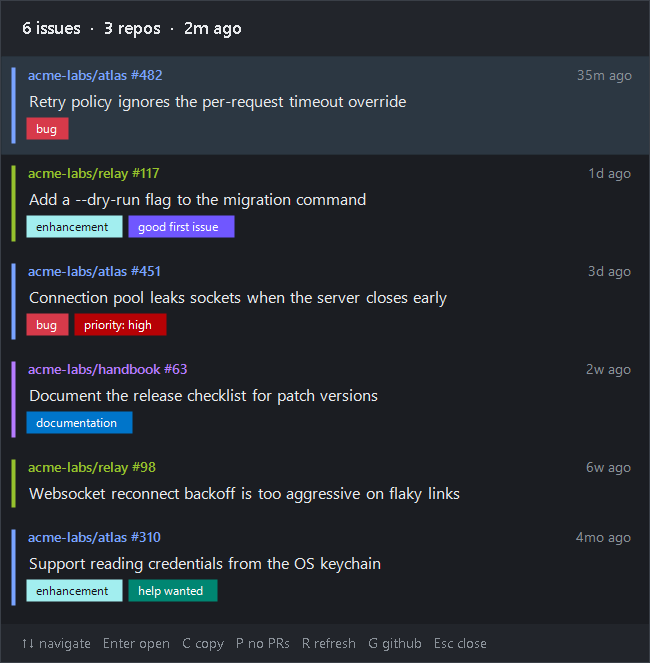

# GitHub Issues Tray

The GitHub issues assigned to you, counted in the Windows tray.

A Windows port of the [omarchy-issues](https://ericksasse.com/omarchy-issues/) plugin:
the tray icon shows how many open issues are assigned to you, one click opens the
list, and clicking an item opens the issue in your browser.



## How it works

- **No token of its own.** Authentication is delegated to the
  [GitHub CLI](https://cli.github.com/): the app runs `gh search issues --assignee @me`
  and `gh search prs --assignee @me` with the credentials already in `gh auth status`.
  Nothing is stored here.
- **No server in between.** It talks straight to the GitHub API, through `gh`.
- **Plain PowerShell + WinForms.** No dependencies: no Node, no Electron, no npm.
  About 700 lines of PowerShell and the `gh` CLI.
- The tray icon is drawn at runtime with the number inside it (grey at zero, red with
  a `!` when `gh` fails).

## Requirements

- Windows 10/11
- [GitHub CLI](https://cli.github.com/), signed in — `winget install GitHub.cli` then `gh auth login`

## Install

```powershell
git clone https://github.com/esasse/github-issues-tray.git
cd github-issues-tray
powershell -ExecutionPolicy Bypass -File .\Install-Autostart.ps1
```

`Install-Autostart.ps1` only creates a shortcut in your Startup folder
(`shell:startup`) pointing at `start.vbs` — **no UAC prompt**, no scheduled task, no
registry writes.

To run it right away instead of waiting for the next logon, double-click `start.vbs`.

To uninstall: `powershell -ExecutionPolicy Bypass -File .\Install-Autostart.ps1 -Remove`

## Use

**Tray icon**

| Action | Result |
|---|---|
| Left click | open/close the list |
| Middle click | open the most recently updated issue |
| Right click | menu (refresh, include PRs, sign in, configuration, quit) |
| `Ctrl+Win+I` | open/close the list from anywhere |

**Inside the list**

| Key | Action |
|---|---|
| `↑` `↓` | move |
| `Enter` or left click | open the issue in the browser |
| `C` or middle click | copy the link |
| `P` | include/exclude pull requests |
| `R` | refresh now |
| `G` | open github.com/issues/assigned |
| `L` | run `gh auth login` |
| `Esc` | close |

Each row shows a colour bar for the repository (derived from its name, so it is stable
across runs), `owner/repo #number`, the title, the labels in their real GitHub colours,
and how long ago the issue was updated.

## Configuration

`config.json`, created from the defaults on first run. The tray menu has **Edit
configuration**, which opens the file. Changes take effect on the next run.

```json
{
  "refreshMinutes": 5,
  "maxItems": 50,
  "includePullRequests": false,
  "showLabels": true,
  "hotkey": "Ctrl+Win+I",
  "accentColor": "#00A8FF",
  "popupWidth": 520,
  "popupMaxHeight": 620
}
```

`P` toggles pull requests instantly, without hitting the API again: both lists are
always fetched together and the filtering is local. `includePullRequests` only decides
how the app starts up.

### About the global hotkey

The default is `Ctrl+Win+I` rather than the original plugin's `Ctrl+Win+N`, because on
Windows 11 `Win+Ctrl+N` already belongs to Narrator. Accepted modifiers: `Ctrl`, `Alt`,
`Shift`, `Win` (or `Super`). If the chosen combination is already taken by another
program, the app notes it in the log and starts normally, just without the hotkey.

## Where things live

| What | Where |
|---|---|
| Configuration | `config.json`, next to the script |
| Cache of the last query | `%LOCALAPPDATA%\github-issues-tray\cache.json` |
| Log | `%LOCALAPPDATA%\github-issues-tray\tray.log` |
| Startup shortcut | `%APPDATA%\Microsoft\Windows\Start Menu\Programs\Startup` |

The cache exists so the list is already populated the moment the app comes up, before
the first query finishes.

## When a refresh fails

A failed refresh does not throw away what the app already has. The count stays in the
tray, greyed out instead of blue, the popup header says `could not refresh`, and the
list keeps showing the last good data with its real age. The red `!` icon is only for
when there is genuinely nothing to show.

Failures retry on their own after 20s, 60s, 120s and 300s before falling back to the
normal interval, and the app watches its own clock: if the wall clock jumps by more
than three minutes, the machine was suspended, so it refreshes immediately instead of
waiting for the next tick. Between them, those two cover the common case by far — a
laptop waking up with the network a few seconds behind it.

## Implementation notes

Five things that are not obvious and that break if changed carelessly:

1. **The `.ps1` must be saved as UTF-8 _with_ BOM.** Without the BOM, Windows
   PowerShell 5.1 reads the file as ANSI (cp1252) and every non-ASCII literal — the
   `↑↓` in the footer, the `·` separators, the `…`, the 🎉 in the empty state — arrives
   mangled on screen. An editor that saves without a BOM reintroduces the bug silently.
2. **It has to be `powershell.exe` (5.1), not `pwsh`.** PowerShell 7 uses
   `System.Drawing.Common`, which is not in the runtime — `New-Object
   System.Drawing.Bitmap` fails with `CS1069`. `start.vbs` already invokes the right
   binary.
3. **The icon is recreated on every refresh and the old handle has to die.**
   `Bitmap.GetHicon()` allocates a GDI handle that `Icon.Dispose()` does not release;
   without the explicit `DestroyIcon` the app leaks handles over the days it stays open.
4. **The process declares DPI awareness (Per-Monitor V2) before creating any window.**
   Without it, on a display scaled above 100% Windows stretches the window as a bitmap
   and the font comes out blurry. In exchange, WinForms stops scaling on its own: fonts
   are declared in points and GDI+ converts them by the device DPI, but **every pixel
   measurement in the layout goes through `S()`**, and line heights come from
   `Font.GetHeight()` measured at the current DPI — a fixed constant makes the text
   overlap at 150%. When the popup opens on a monitor with a different scale,
   `Show-Popup` re-reads the DPI and rebuilds the layout.

5. **`NotifyIcon.Text` is limited to 63 characters, and throws above that.** Not 127,
   which is the number the .NET source suggests if you skim it —
   `ArgumentOutOfRangeException: Text length must be less than 64 characters long`.
   Because the tooltip is set from a timer callback, an over-long one escaped as an
   unhandled exception and put a modal .NET crash dialog on screen; the caught message
   then went back into the error text and made the next tooltip longer still. The
   tooltip is now built to be short by design, clamped in `Set-TrayTooltip`, and the
   reason for a failure always goes to the log, and to the popup when there is
   nothing left to list — both have room for it.
   `Application.ThreadException` is handled too, so no bug in a callback can put a
   dialog in front of the user again.

Fetching does not block the UI: `gh` runs in two child processes whose output is
drained by `ReadToEndAsync()` (avoiding the classic full-pipe deadlock), and a 250 ms
timer collects the result. Past 60 s the app kills the processes and shows the error
state.

## License

MIT
